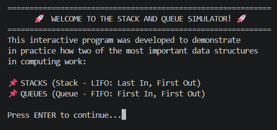
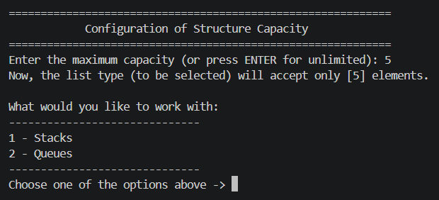
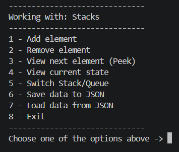
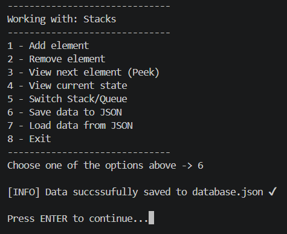

[🇧🇷 Português](./README.pt-BR.md) | [🇬🇧 English](./README.md)

<p align="center">
  
</p>

<p align="center">
  <table align="center">
    <tr>
      <td align="center">
        <br>
        <sub><b>Introdução</b></sub>
      </td>
      <td align="center">
        <br>
        <sub><b>Configuração de capacidade e seleção de qual lista manipular</b></sub>
      </td>
    </tr>
    <tr>
      <td align="center">
        <br>
        <sub><b>Menu numérico</b></sub>
      </td>
      <td align="center">
        <br>
        <sub><b>Adição ao banco de dados .json</b></sub>
      </td>
    </tr>
  </table>
</p>

# 🚀 Visualizador de Estruturas de Dados (Pilhas e Filas)

Este projeto foi desenvolvido para fins de estudo durante o 1º semestre do curso de Análise e Desenvolvimento de Sistemas (ADS). A ideia foi criar um simulador interativo em **Python** via terminal para visualizar, na prática, o funcionamento de duas das estruturas de dados lineares mais fundamentais da computação: **Pilhas (LIFO)** e **Filas (FIFO)**.

O sistema possui menus interativos, conceitos teóricos integrados e validações de entrada para garantir uma navegação fluida e sem erros em tempo real.

---

## 🛠️ Como o projeto funciona?

Para aplicar conceitos de boas práticas e manter um código limpo, modular e fácil de manter, a lógica foi totalmente separada por responsabilidades:

* **`main.py`**: Ponto de entrada da aplicação, responsável por iniciar o programa mantendo o escopo encapsulado.
* **`src/structures.py`**: Motor principal que gerencia a execução do programa (`run_code`) e as operações nas estruturas (adicionar, remover e exibir).
* **`src/classes.py`**: Contém as abstrações e representações necessárias para o gerenciamento dos tipos de dados.
* **`src/menu.py`**: Centraliza utilitários de interface de terminal, como menus numerados, leitura de dados validada e limpeza de tela.
* **`src/lessons.py`**: Arquivo dedicado ao armazenamento de textos educacionais, conceitos teóricos (LIFO e FIFO) e banners do sistema.
* **`src/database.py`**: Responsável pela lógica de subir os itens presentes em sua respectiva lista para um mini banco de dados .json gerado automaticamente pelo sistema caso não exista um. Em conjunto a isso possui também um método encarregado de 'baixar' os itens existentes nos dicionários criados dentro do database.json e armazena-los novamente em suas devidas posições independente da lista.
* **`tests/*`**: Pasta definida para testar as funcionalidades dos arquivos individualmente sem necessidade de rodar o programa inteiro para encontrar um bug.

---

## 💡 Conceitos Demonstrados

* **Pilha (LIFO - Last In, First Out / Último a Entrar, Primeiro a Sair):** O último elemento a entrar é o primeiro a ser removido (exemplo: pilha de pratos ou histórico do navegador).
* **Fila (FIFO - First In, First Out / Primeiro a Entrar, Primeiro a Sair):** O primeiro elemento a entrar é o primeiro a ser removido (exemplo: fila de banco ou fila de impressão).

---

## 📃 Licença

Esse projeto está sob a licença MIT. Veja o arquivo [LICENSE](LICENSE) para mais detalhes. 

## 🚀 Como executar na sua máquina

1. **Clone o repositório:**
   ```bash
   git clone [https://github.com/gabbrielbf/data-structure-visualizer.git](https://github.com/gabbrielbf/data-structure-visualizer.git)
   cd data-structure-visualizer